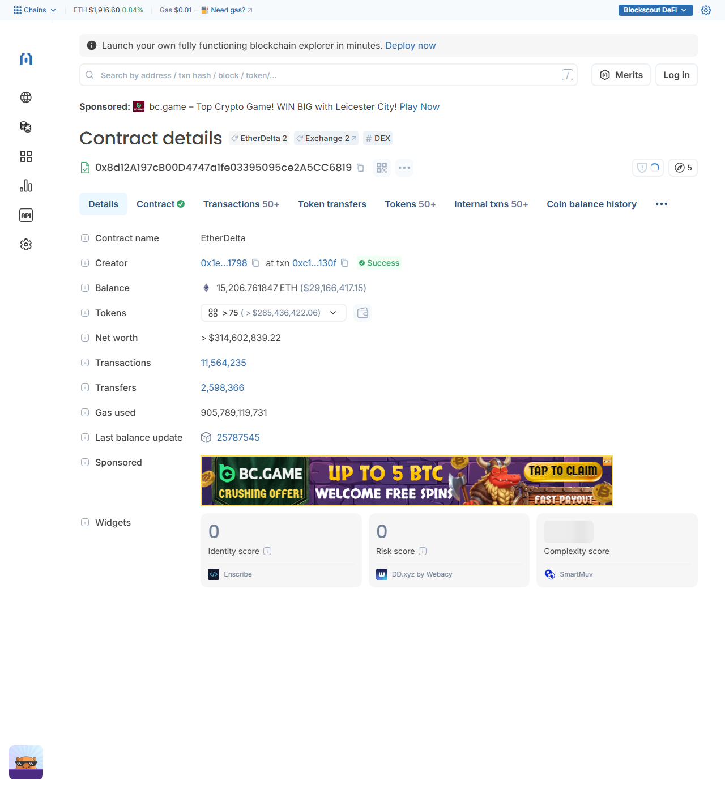
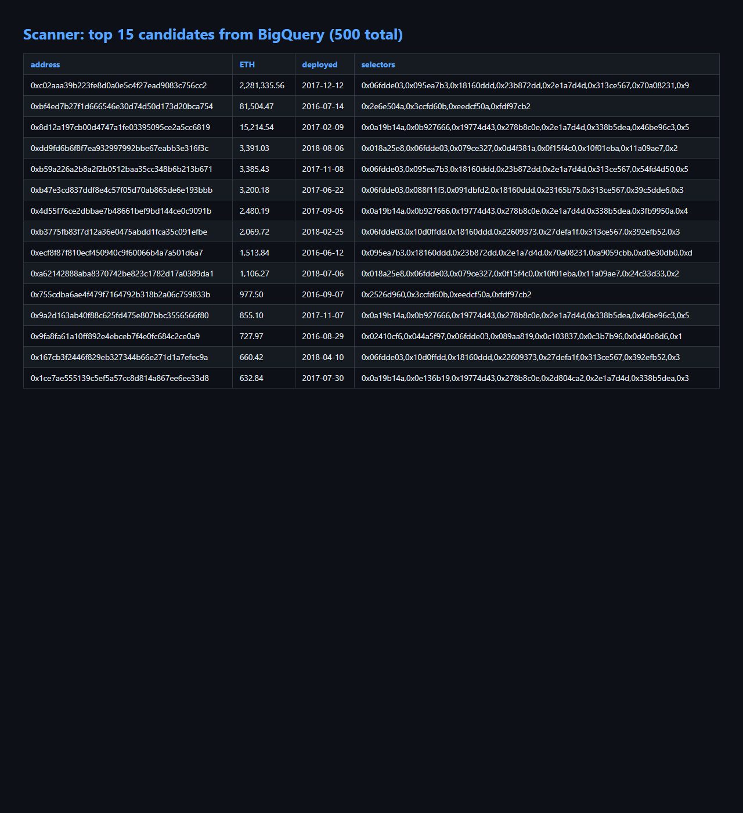
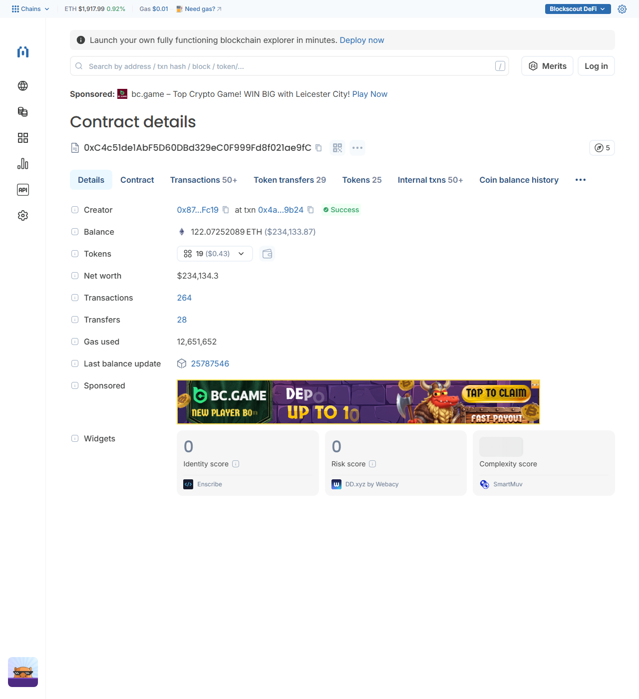
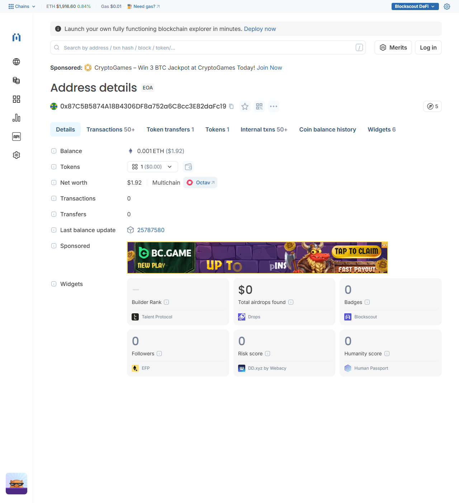
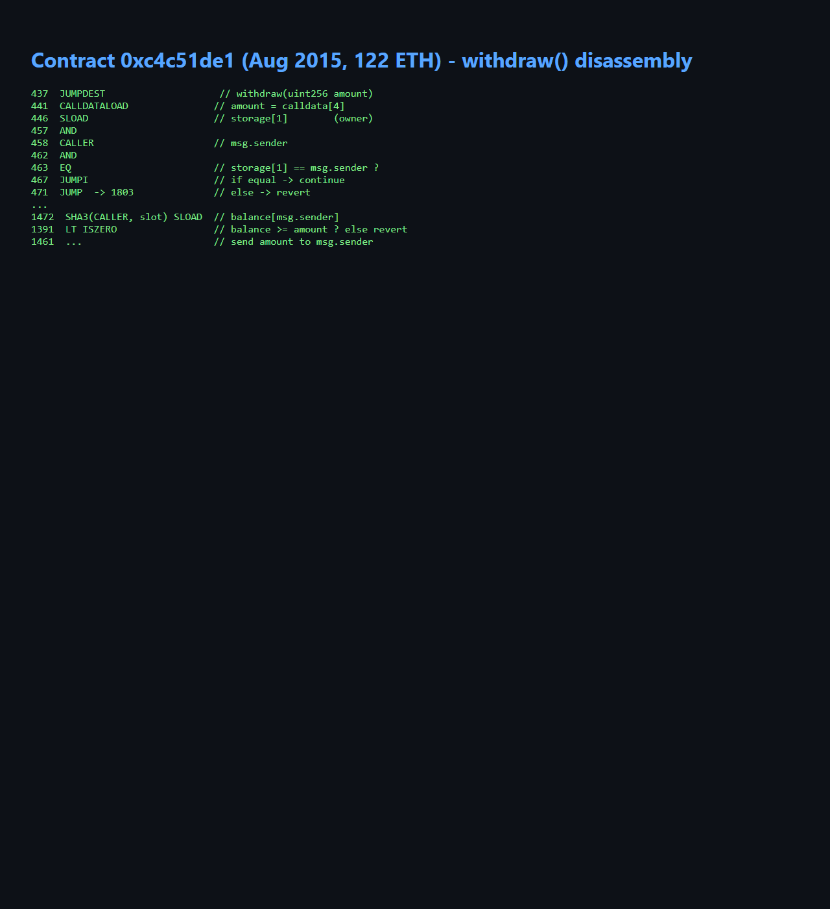

# EtherDelta: ~15,214 ETH of unclaimed deposits, still withdrawable

The main EtherDelta exchange contract still holds about **15,214 ETH** in
user deposit balances. EtherDelta shut down years ago, but the contract is
alive and `withdraw()` works: every user balance is still recorded in the
contract's `tokens` mapping, and anyone with an old account can pull their
funds out in a single transaction.

- **Contract:** [`0x8d12a197cb00d4747a1fe03395095ce2a5cc6819`](https://etherscan.io/address/0x8d12a197cb00d4747a1fe03395095ce2a5cc6819) (Solidity 0.4.9, deployed Feb 2017)
- **Held:** ~15,214 ETH of unclaimed user balances
- **Status:** contract is live; dust amounts are withdrawn daily by bots,
  but all larger balances remain unclaimed
- **Fee:** none. Withdrawals are free of contract fees (`feeMake = 0`)

If you deposited ETH or tokens on EtherDelta in 2017-2018 and never fully
withdrew, see [CLAIM.md](CLAIM.md) for the exact 3-step process.

## How it was found

I run an on-chain scanner pipeline over Ethereum data:

1. BigQuery (`bigquery-public-data.crypto_ethereum`): every contract deployed
   before 2020 with a balance above a threshold and `refund`/`claim`/`withdraw`
   selectors in its bytecode.
2. Candidates are ranked by balance, age and selector profile, then identified
   via Blockscout, then verified on-chain through a public RPC
   (balance, bytecode, storage).
3. Top candidates are disassembled by hand to confirm who can move the funds.

EtherDelta surfaced as the biggest unclaimed-balance contract. Its source is
verified on Etherscan: `withdraw(uint256)` checks `tokens[0][msg.sender]` and
sends ETH to the caller, no owner involvement, no fee.

Full candidate data: [`scanner/shortlist.csv`](scanner/shortlist.csv)
(369 unidentified contracts with withdrawal functions, ~10,000+ ETH total),
[`scanner/identified.csv`](scanner/identified.csv) (500 identified candidates),
case notes in [`FINDINGS.md`](FINDINGS.md).

## Files

| File | Contents |
| --- | --- |
| [`CLAIM.md`](CLAIM.md) | How to check and withdraw your balance |
| [`FINDINGS.md`](FINDINGS.md) | Case notes: analyzed contracts, disassembly results, methodology errors and fixes |
| [`scanner/`](scanner/) | Tooling: BigQuery queries, ranker, identifier, disassembler, screenshots |

## Proof

EtherDelta contract page (balance ~15,214 ETH):

Scanner: 500 candidates from one BigQuery query:

The 2015 contract and its sleeping owner:

`withdraw()` disassembly (owner check in storage slot 1):

## Ethics

All funds in this contract belong to their original depositors. This
repository only documents how owners can reclaim their own money. No fee is
taken, no third-party address appears in the withdrawal path.
